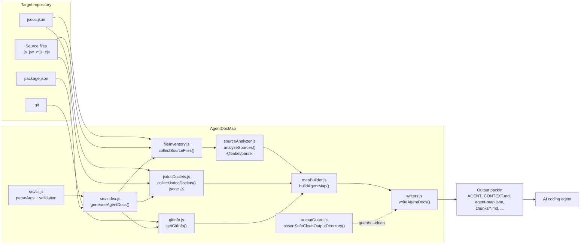
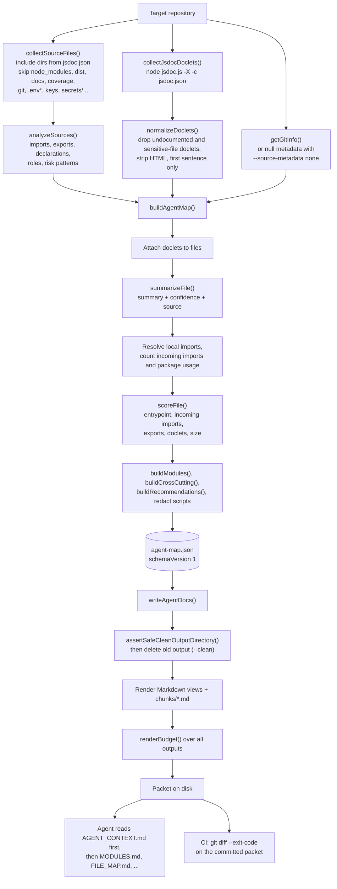
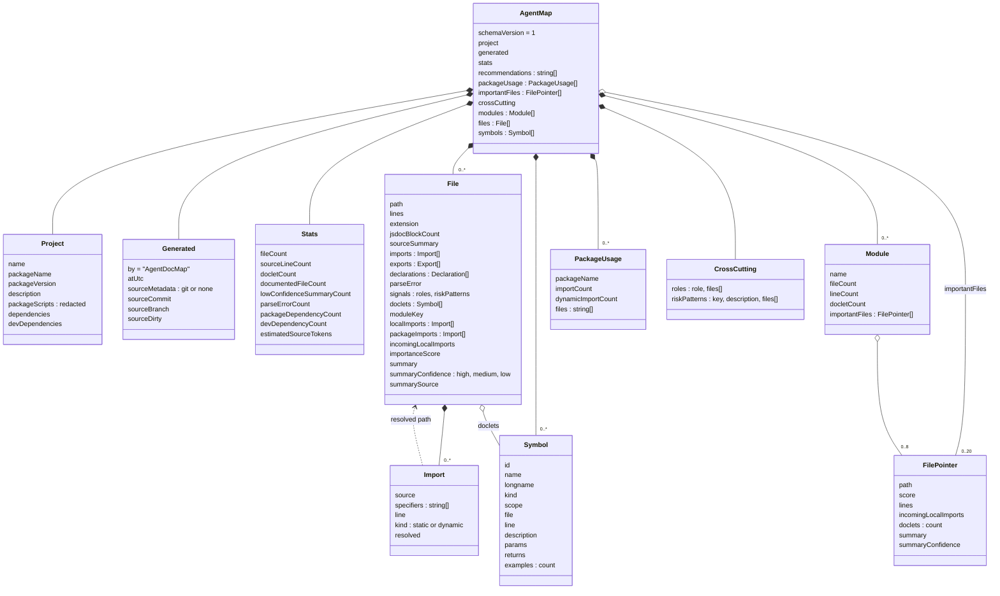
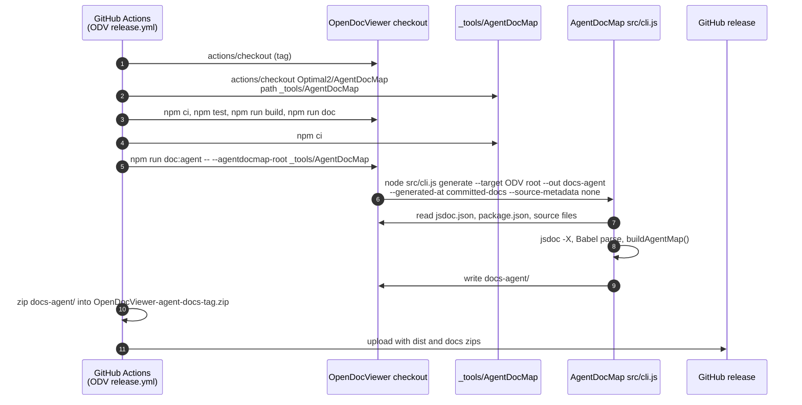

# AgentDocMap

AgentDocMap is a Node.js command-line tool that reads a JavaScript repository
and its existing JSDoc comments and writes a compact, deterministic
documentation packet (Markdown + JSON) that AI coding agents read before they
open source files.

[](https://github.com/Optimal2/AgentDocMap/actions/workflows/ci.yml)
[](LICENSE)
[](package.json)


Current version: **0.1.1** (`package.json`). The package is marked
`"private": true` and is not published to npm; it is used from a Git checkout.

## Contents

- [What it is](#what-it-is)
- [What it is not](#what-it-is-not)
- [Architecture](#architecture)
- [Main flow: from source files to an agent packet](#main-flow-from-source-files-to-an-agent-packet)
- [Example: input and output](#example-input-and-output)
- [The map data model](#the-map-data-model)
- [Output files](#output-files)
- [Quick start](#quick-start)
- [CLI reference](#cli-reference)
- [Use in OpenDocViewer](#use-in-opendocviewer)
- [Security](#security)
- [Development and tests](#development-and-tests)
- [Documentation index](#documentation-index)
- [License](#license)

## What it is

- A generator with one command, `generate` (`src/cli.js`), that points at a
  target repository and writes a folder of documentation meant as the first
  thing an AI agent reads.
- It uses the target's **existing** JSDoc comments as-is. Target projects do
  not add AgentDocMap-specific annotations.
- It combines two independent sources of truth:
  - **JSDoc doclets** from running the JSDoc CLI in explain mode (`jsdoc -X`)
    against the target (`src/lib/jsdocDoclets.js`).
  - **Source structure** from parsing every source file with `@babel/parser`:
    imports (static and constant-specifier `import()`), exports, declarations,
    roles, and risky patterns (`src/lib/sourceAnalyzer.js`).
- It merges both into one map (`agent-map.json`, `schemaVersion: 1`) and
  renders short Markdown views of that map: an entry point
  (`AGENT_CONTEXT.md`), module and file maps, entrypoints, dependencies,
  cross-cutting concerns, a symbol index, a quality report, a token budget,
  and one chunk per module (`src/lib/writers.js`).
- Output is deterministic when you pass `--generated-at` and
  `--source-metadata none`, so a generated packet can be committed and checked
  in CI with `git diff --exit-code`.

## What it is not

- Not an HTML documentation site. Use JSDoc itself for that; AgentDocMap
  produces agent-oriented navigation, not reference pages.
- Not a replacement for reading source. The packet points agents at the right
  files and symbols; it does not reproduce implementations.
- Not a TypeScript analyzer. Files are selected by the target's `jsdoc.json`
  `includePattern`, defaulting to `.js`, `.jsx`, `.mjs` and `.cjs`
  (`src/lib/fileInventory.js`).
- Not an LLM tool. Summaries are taken from JSDoc text or derived from exports
  and declarations; no model is called, and the tool makes no network
  requests.
- Not a sandbox. It runs the JSDoc CLI with the target's `jsdoc.json`, so only
  run it on repositories you trust (see [Security](#security)).

## Architecture



Derived from `src/cli.js`, `src/index.js` (`generateAgentDocs`) and the
modules in `src/lib/`: `fileInventory.js`, `sourceAnalyzer.js`,
`jsdocDoclets.js`, `gitInfo.js`, `mapBuilder.js`, `writers.js`,
`outputGuard.js`. `gitInfo.js` is skipped when `--source-metadata none` is
set.

| Module | Responsibility |
| --- | --- |
| `src/cli.js` | Parses arguments, rejects unknown options, prints totals. |
| `src/index.js` | Orchestrates one run; reads `package.json` and `jsdoc.json` from the target. |
| `src/lib/fileInventory.js` | Walks `jsdoc.json` `source.include` (default `src`, `server`), applies include/exclude patterns, drops sensitive file and directory names. |
| `src/lib/sourceAnalyzer.js` | Parses each file with `@babel/parser` (JSX, dynamic import, top-level await, ...) and records imports, exports, declarations, leading JSDoc summary, roles and risk patterns. |
| `src/lib/jsdocDoclets.js` | Runs `node_modules/jsdoc/jsdoc.js -X -c <target>/jsdoc.json` (or `-X src` when there is no config) and parses the JSON. |
| `src/lib/gitInfo.js` | Reads commit, commit date, branch and dirty state with `git`. |
| `src/lib/mapBuilder.js` | Filters and normalizes doclets, resolves local imports, scores files, groups modules, collects cross-cutting signals, redacts secrets in package scripts. |
| `src/lib/writers.js` | Renders Markdown/JSON, escapes untrusted text, computes the token budget, writes files. |
| `src/lib/outputGuard.js` | Refuses to delete an output directory unless it is safe (see [CLI reference](#cli-reference)). |
| `src/lib/projectSignals.js` | Shared list of entrypoint file names (`index.js`, `main.jsx`, `App.jsx`, `vite.config.js`, ...). |

## Main flow: from source files to an agent packet



Derived from `generateAgentDocs` in `src/index.js`, `buildAgentMap`,
`normalizeDoclets`, `summarizeFile`, `scoreFile`, `buildModules`,
`buildCrossCutting` and `buildRecommendations` in `src/lib/mapBuilder.js`, and
`writeAgentDocs` / `renderBudget` in `src/lib/writers.js`. The CI step at the
bottom is the OpenDocViewer "Agent Documentation" workflow described in
[Use in OpenDocViewer](#use-in-opendocviewer).

Details that matter when reading the output:

- **Summaries carry confidence.** `summarizeFile()` picks, in order: a
  `@module` doclet, a leading file-level JSDoc block, the best-scoring doclet
  for an exported or declared name, then source exports/declarations. Each
  file gets `summaryConfidence` (`high`, `medium`, `low`) and `summarySource`
  (`module-doclet`, `leading-jsdoc`, `doclet`, `source-export`,
  `source-declaration`, `none`).
- **Importance score.** `scoreFile()` adds 80 for entrypoint names, 20 for
  files under `server/`, up to 60 for incoming local imports (8 each), up to
  30 for exports, up to 24 for doclets and up to 20 for file size. The top 20
  become `importantFiles`.
- **Modules.** `moduleKeyForPath()` groups `src/<folder>` and
  `src/components/<folder>` into separate modules; each module becomes one
  file in `chunks/`.
- **Roles** (`detectRoles()`): `hook`, `context`, `worker`, `test`, `config`.
  **Risk patterns** (`RISK_PATTERNS`): `dangerouslySetInnerHTML`, `eval(`,
  `.innerHTML`, with up to 12 line numbers per file.

## Example: input and output

This is a real run against the fixture that the test suite uses,
`test/fixture-project/`. Input (3 files, 34 lines):

```js
// test/fixture-project/src/math.js
/**
 * Doubles a numeric value.
 * @param {number} value Input value.
 * @returns {number} Doubled value.
 */
export function double(value) {
  return value * 2;
}
```

```js
// test/fixture-project/src/index.js
import { double } from './math.js';

/**
 * Formats a doubled number for display.
 * @param {number} value Input value.
 * @returns {string} Display text.
 */
export function formatDouble(value) {
  return `Value: ${double(value)}`;
}
```

`src/lazy.js` does the same through `await import('lazy-formatter')` and
`await import('./math.js')`, which exercises dynamic-import tracking.

Command (the `tmp/` folder is ignored by Git):

```console
$ node src/cli.js generate --target test/fixture-project --out tmp/fixture-agent-docs --generated-at example --source-metadata none
AgentDocMap wrote 14 files to <repo>/tmp/fixture-agent-docs
Indexed 3 files and 3 JSDoc doclets.
```

Output folder:

```text
tmp/fixture-agent-docs/
├── AGENT_CONTEXT.md
├── BUDGET.md
├── CROSS_CUTTING.md
├── DEPENDENCIES.md
├── ENTRYPOINTS.md
├── FILE_MAP.md
├── MODULES.md
├── REPORT.md
├── SYMBOL_INDEX.md
├── agent-map.json
├── symbol-index.json
└── chunks/
    ├── src_index.js.md
    ├── src_lazy.js.md
    └── src_math.js.md
```

`AGENT_CONTEXT.md` (excerpt; the read order list is shortened):

```markdown
# fixture\-project Agent Context

Generated: example
Source commit: not embedded

## Project

- Package: fixture\-project
- Version: 1.0.0
- Description: Tiny fixture for AgentDocMap tests.

## Read Order

1. Read this file.
2. Open `MODULES.md` for top-level structure.
3. Open `FILE_MAP.md` only for the area you need.
...

## Stats

- Source files: 3
- Source lines: 34
- JSDoc symbols: 3
- Files with JSDoc: 3
- Low-confidence summaries: 0
- Parse errors: 0

## High-Signal Files

- `src/index.js` - Formats a doubled number for display.
- `src/math.js` - Doubles a numeric value.
- `src/lazy.js` - Loads the optional formatter package on demand and doubles the value first.
```

`DEPENDENCIES.md` notices that `lazy-formatter` is imported but not declared
in `package.json`:

```markdown
## Imported But Not Declared Directly

- `lazy-formatter`: 1 imports in 1 files
```

`agent-map.json` (excerpt of the entry for `src/index.js`):

```json
{
  "path": "src/index.js",
  "lines": 11,
  "exports": [{ "name": "formatDouble", "kind": "function", "line": 8 }],
  "localImports": [
    { "source": "./math.js", "specifiers": ["double"], "line": 1, "kind": "static", "resolved": "src/math.js" }
  ],
  "packageImports": [],
  "incomingLocalImports": 0,
  "importanceScore": 88,
  "summary": "Formats a doubled number for display.",
  "summaryConfidence": "high",
  "summarySource": "doclet"
}
```

`src/index.js` scores 88 because `index.js` is an entrypoint name (80), it
has one export (5) and one doclet (3).

For a real-size example, `examples/opendocviewer-agent-docs/` holds the
committed packet for OpenDocViewer. At the time that snapshot was generated,
it covered 114 source files, 49,449 source lines and 1,318 JSDoc symbols in
30 output files. It is a calibration snapshot: it is regenerated when
generator behavior changes, not every time OpenDocViewer changes.

## The map data model

`agent-map.json` is the full structured map; every Markdown file is a view of
it. `symbol-index.json` is `symbols` on its own.



Derived from the object returned by `buildAgentMap()` and from
`toFilePointer()`, `buildModules()`, `countPackageUsage()` and
`buildCrossCutting()` in `src/lib/mapBuilder.js`, and from the per-file record
built by `analyzeFile()` in `src/lib/sourceAnalyzer.js`. Field names match
the JSON keys. `resolved` exists only on `localImports`.

## Output files

| File | Content | Rendered by |
| --- | --- | --- |
| `AGENT_CONTEXT.md` | Entry point: project, read order, stats, high-signal files, recommendations. | `renderAgentContext` |
| `MODULES.md` | Module list with file, line and symbol counts. | `renderModules` |
| `FILE_MAP.md` | Every file with summary, imports, exports and JSDoc density. | `renderFileMap` |
| `ENTRYPOINTS.md` | Package scripts (secrets redacted), startup files, import hubs. | `renderEntrypoints` |
| `DEPENDENCIES.md` | Declared packages joined with observed imports; undeclared imports. | `renderDependencies` |
| `CROSS_CUTTING.md` | Hooks, contexts, workers, tests, config files, risky source patterns. | `renderCrossCutting` |
| `SYMBOL_INDEX.md` | JSDoc-backed symbols per file. | `renderSymbolIndex` |
| `REPORT.md` | Coverage, parse errors, low-confidence summaries. | `renderReport` |
| `BUDGET.md` | Output size and token estimate (one token per four characters). | `renderBudget` |
| `chunks/<module>.md` | Compact context for one module. | `renderModuleChunk` |
| `agent-map.json` | The full map (see the data model above). | `toJsonString` |
| `symbol-index.json` | Normalized JSDoc symbol list. | `toJsonString` |

All renderers live in `src/lib/writers.js`.

## Quick start

Requirements: Node.js 22.18.0 or later (`engines` in `package.json`; CI uses
22.18.0) and Git. Runtime dependencies: `@babel/parser` and `jsdoc`.

```powershell
git clone https://github.com/Optimal2/AgentDocMap.git
cd AgentDocMap
npm ci
npm test
node src/cli.js generate --target ../YourProject --out ../YourProject/docs-agent --generated-at committed-docs --source-metadata none
```

Then open `../YourProject/docs-agent/AGENT_CONTEXT.md`.

To use the `agentdocmap` command instead of `node src/cli.js`, run `npm link`
in the AgentDocMap checkout (`bin` in `package.json`).

What the tool reads from the target:

| Input | Used for | When missing |
| --- | --- | --- |
| `jsdoc.json` → `source.include` | Directories to scan | `src` and `server` |
| `jsdoc.json` → `source.includePattern` / `excludePattern` | File filters | `.js/.jsx/.mjs/.cjs`; excludes `node_modules`, `dist`, `docs`, `coverage`, `.git`, `.agentdocmap` |
| `jsdoc.json` (whole file) | Passed to `jsdoc -c` | JSDoc runs on `src` |
| `package.json` | Name, version, description, scripts, dependencies | Project name falls back to the folder name |
| Git metadata | Commit, date, branch, dirty flag; default `--generated-at` | Fields are `null`; timestamp is the current time |

## CLI reference

```text
agentdocmap generate --target <repo> --out <dir> [--project-name <name>]
                     [--generated-at <text>] [--source-metadata git|none] [--no-clean]
```

| Option | Description |
| --- | --- |
| `--target <path>` | Target repository root. Required. |
| `--out <path>` | Output directory. Required. |
| `--project-name <name>` | Display name. Defaults to `package.json` `name`, then the folder name. |
| `--generated-at <text>` | Timestamp or label written into the output. Defaults to the target's last commit date, which keeps output stable for an unchanged commit. |
| `--source-metadata <git\|none>` | `git` (default) embeds commit, branch and dirty flag. Use `none` for packets committed into the target repository itself, where the commit hash would change the output on every commit. |
| `--no-clean` | Do not delete the output directory first. |
| `-h`, `--help` | Show help. |

**Output directory guard.** By default the output directory is deleted before
writing. `assertSafeCleanOutputDirectory()` only allows that when the
directory:

- is named `docs-agent`, or ends in `-agent-docs` (letters, digits, `.`, `_`,
  `-` only), or is `agentdocmap-*` directly inside the OS temp directory; and
- is not the target root or one of its ancestors, the current working
  directory, a home directory, a drive root, or a system directory
  (`/etc`, `/usr`, `%ProgramFiles%`, `%SystemRoot%`, ...).

Writing to `<target>/docs-agent` is allowed. Use `--no-clean` for any other
directory.

## Use in OpenDocViewer

[OpenDocViewer](https://github.com/Optimal2/OpenDocViewer) is the first
consumer and the real-world validation target. It commits its packet in
`docs-agent/` and its `AGENTS.md` tells agents to read
`docs-agent/AGENT_CONTEXT.md` first. It calls AgentDocMap through its own
wrapper, `npm run doc:agent` (`scripts/generate-agent-docs.mjs`), which finds
AgentDocMap via `--agentdocmap-root`, the `AGENTDOCMAP_ROOT` environment
variable, or a sibling `../AgentDocMap` checkout, and then runs
`src/cli.js generate` with `--out docs-agent`,
`--generated-at committed-docs` and `--source-metadata none`.

Two OpenDocViewer GitHub Actions workflows check out this repository:

- **Agent Documentation** (`.github/workflows/agent-docs.yml`, every push and
  pull request): checks out AgentDocMap next to OpenDocViewer, regenerates
  `docs-agent/` and fails on `git diff --exit-code -- docs-agent` if the
  committed packet is stale.
- **Release** (`.github/workflows/release.yml`, on version tags): checks out
  AgentDocMap into `_tools/AgentDocMap`, builds the packet and attaches it to
  the GitHub release as `OpenDocViewer-agent-docs-<tag>.zip`.



Derived from OpenDocViewer's `.github/workflows/release.yml` (steps "Check out
AgentDocMap", "Install AgentDocMap deps", "Build agent docs", "Package agent
docs") and `scripts/generate-agent-docs.mjs`. Neither workflow pins an
AgentDocMap ref, so both use the current default branch: a generator change
here can make OpenDocViewer's "Agent Documentation" check fail until
`docs-agent/` is regenerated there.

## Security

See [SECURITY.md](SECURITY.md) for supported versions and how to report a
vulnerability. Built-in protections, each covered by tests in `test/`:

- **Sensitive files are not read.** `.env*`, key and certificate files, SSH
  keys, `.npmrc`/`.netrc`-style credential files, `secret.*`/`token.*`-style
  files, `*.local.*` configs, and directories such as `secrets/`,
  `credentials/`, `.aws/` are skipped by the inventory, and their doclets are
  dropped (`isSensitiveFileName()` in `src/lib/fileInventory.js`).
- **Package scripts are redacted** before output: token/secret/password
  assignments, `Authorization` headers, credentials in URLs and npm
  `_authToken` values become `***` (`redactScript()` in
  `src/lib/mapBuilder.js`).
- **Untrusted text is escaped** when rendered into Markdown tables and inline
  text (`src/lib/writers.js`).
- **Output deletion is guarded** (see [CLI reference](#cli-reference)).

AgentDocMap does not run target application code, but JSDoc loads any
`plugins` listed in the target's `jsdoc.json`. Treat the target as trusted
input, and review a packet before publishing it.

## Development and tests

```powershell
npm ci
npm test            # node --test test/*.test.js
npm run build:odv   # regenerate examples/opendocviewer-agent-docs from ../OpenDocViewer
npm run validate    # npm test && npm run build:odv
```

`build:odv` and `validate` expect an OpenDocViewer checkout next to this
repository (`../OpenDocViewer`). CI (`.github/workflows/ci.yml`) checks out
both repositories side by side on Node 22.18.0 and runs `npm run validate`.

Test files:

| File | Covers |
| --- | --- |
| `test/generate.test.js` | End-to-end generation against `test/fixture-project/`, dynamic-import counting, Markdown escaping. |
| `test/writers.test.js` | Rendered `AGENT_CONTEXT.md` and `DEPENDENCIES.md` content; output guard through `writeAgentDocs()`. |
| `test/secretSafety.test.js` | Sensitive-file exclusion and script redaction. |
| `test/outputGuard.test.js` | `assertSafeCleanOutputDirectory()` rules. |
| `test/concurrency.test.js` | Deterministic output across parallel runs; concurrent runs into one directory. |

See [CONTRIBUTING.md](CONTRIBUTING.md) for change guidelines.

## Documentation index

| Document | Purpose |
| --- | --- |
| [README.md](README.md) | This overview. |
| [AGENTS.md](AGENTS.md) | Instructions for AI agents working in this repository. |
| [CONTRIBUTING.md](CONTRIBUTING.md) | Change guidelines and validation. |
| [SECURITY.md](SECURITY.md) | Supported versions, reporting, security model. |
| [docs/ITERATION_LOG.md](docs/ITERATION_LOG.md) | How the generator evolved against OpenDocViewer. |
| [examples/opendocviewer-agent-docs/AGENT_CONTEXT.md](examples/opendocviewer-agent-docs/AGENT_CONTEXT.md) | Entry point of the committed OpenDocViewer example packet. |

## License

[MIT](LICENSE)
